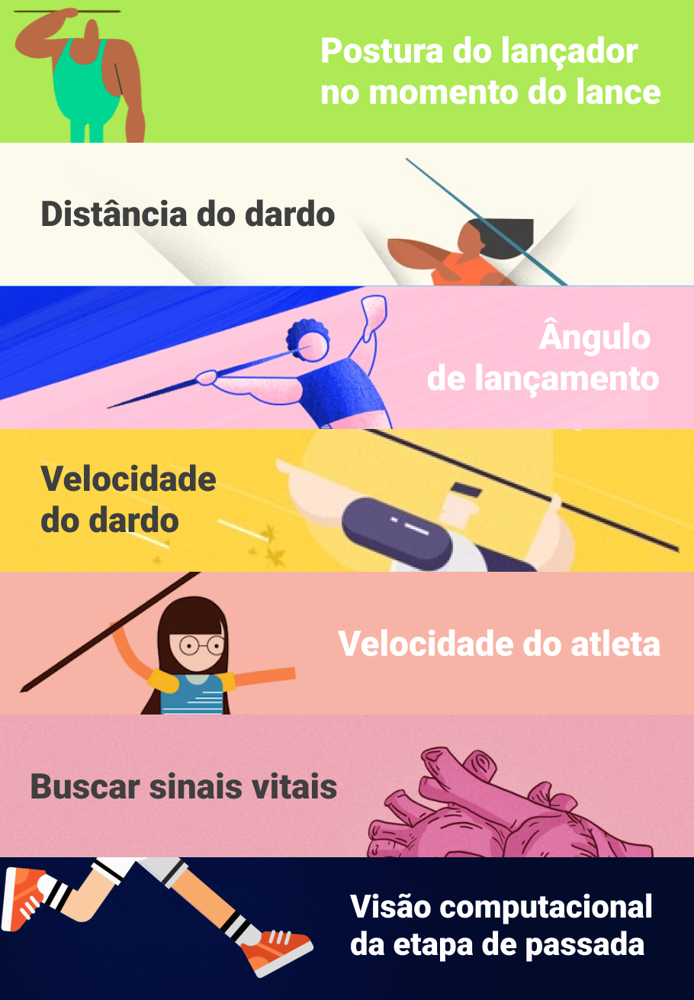

 

    

 
 

## Histórico de Versões

<table>
    <thead>
        <th>Data</th>
        <th>Versão</th>
        <th>Descrição</th>
        <th>Autor(es)</th>
    </thead>
    <tbody>
        <tr>
            <td>18/08/2021</td>
            <td>1.0</td>
            <td>Criando arte para variáveis</td>
            <td>
                Daniel de Sousa O. M. Veras [<a href="https://github.com/dansousamelo">@dansousamelo</a>] e Pedro Rodrigues [<a href="https://github.com/pedro-prp">@pedrp-prp</a>]
            </td>
        </tr>
    </tbody>
</table>
 

## Variáveis Escolhidas

As variáveis a serem considerados na telemetria estão apresentadas abaixo.

 

    

 

### 1. Postura do lançador no momento do lance

### 2. Distância do dardo

### 3. Ângulo de lançamento

### 4. Velocidade do dardo

### 5. Velocidade do atleta

### 6. Buscar sinais vitais

### 7. Visão computacional da etapa de passada

## Referências